# ระบบ AI ประเมินความเสี่ยงโรคเบาหวาน (AI Diabetes Risk Assessment System)

## 📋 ภาพรวมระบบ

ระบบ AI ประเมินความเสี่ยงโรคเบาหวานนี้เป็นระบบที่พัฒนาขึ้นเพื่อช่วยแพทย์และบุคลากรทางการแพทย์ในการประเมินความเสี่ยงโรคเบาหวานของผู้ป่วยอย่างแม่นยำและครอบคลุม โดยใช้ข้อมูลทางการแพทย์ที่หลากหลายและอัลกอริทึมการคำนวณที่ซับซ้อน

---

## 🤖 โมเดล AI ที่ใช้

### **ประเภทโมเดล: Rule-Based Expert System**
- **ไม่ใช่ Machine Learning Model** แต่เป็นระบบผู้เชี่ยวชาญที่ใช้กฎเกณฑ์ทางการแพทย์
- **อัลกอริทึม**: Scoring Algorithm + Risk Factor Analysis
- **วิธีการทำงาน**: วิเคราะห์ปัจจัยเสี่ยงหลายมิติและให้คะแนนตามน้ำหนักที่กำหนด

### **เหตุผลที่เลือก Rule-Based System:**
1. **ความโปร่งใส**: แพทย์สามารถเข้าใจตรรกะการคำนวณได้
2. **ความน่าเชื่อถือ**: ใช้หลักฐานทางการแพทย์ที่ได้รับการยอมรับ
3. **ความยืดหยุ่น**: สามารถปรับแต่งกฎเกณฑ์ได้ง่าย
4. **ความเร็ว**: ประมวลผลได้ทันทีโดยไม่ต้องใช้ GPU

---

## 📊 ข้อมูลที่ใช้ในการวิเคราะห์

### **1. ข้อมูลพื้นฐาน (Basic Demographics)**
```typescript
interface BasicData {
  age: number;                    // อายุ
  gender: 'male' | 'female';      // เพศ
  bmi: number;                    // ดัชนีมวลกาย
  waistCircumference?: number;    // รอบเอว
}
```

### **2. ข้อมูลประวัติครอบครัว (Family History)**
```typescript
interface FamilyHistory {
  familyHistoryDiabetes: boolean;        // ประวัติครอบครัวเป็นเบาหวาน
  familyHistoryHypertension: boolean;    // ประวัติครอบครัวเป็นความดันสูง
}
```

### **3. ข้อมูลทางการแพทย์ (Medical Data)**
```typescript
interface MedicalData {
  bloodPressure: {
    systolic: number;    // ความดันซิสโตลิก
    diastolic: number;   // ความดันไดแอสโตลิก
  };
  fastingGlucose?: number;  // น้ำตาลในเลือดขณะอดอาหาร
  hba1c?: number;          // HbA1c
}
```

### **4. ข้อมูลวิถีชีวิต (Lifestyle Factors)**
```typescript
interface LifestyleData {
  physicalActivity: 'low' | 'moderate' | 'high';  // ระดับการออกกำลังกาย
  smoking: boolean;                               // การสูบบุหรี่
  alcoholConsumption: 'none' | 'light' | 'moderate' | 'heavy';  // การดื่มแอลกอฮอล์
  sleepDuration?: number;                         // ชั่วโมงการนอนต่อคืน
  stressLevel?: 'low' | 'moderate' | 'high';     // ระดับความเครียด
  dietQuality?: 'poor' | 'fair' | 'good' | 'excellent';  // คุณภาพอาหาร
}
```

### **5. ข้อมูลเฉพาะเพศหญิง (Female-Specific Data)**
```typescript
interface FemaleSpecificData {
  gestationalDiabetes?: boolean;        // ประวัติเบาหวานขณะตั้งครรภ์
  polycysticOvarySyndrome?: boolean;    // โรคถุงน้ำรังไข่หลายใบ
}
```

### **6. โรคประจำตัว (Comorbidities)**
```typescript
interface Comorbidities {
  hypertension: boolean;           // โรคความดันโลหิตสูง
  dyslipidemia: boolean;          // ไขมันในเลือดสูง
  cardiovascularDisease: boolean; // โรคหัวใจและหลอดเลือด
}
```

### **7. ข้อมูลเพิ่มเติมสำหรับ AI (Enhanced AI Analysis Fields)**
```typescript
interface EnhancedAIData {
  bodyFatPercentage?: number;      // เปอร์เซ็นต์ไขมันในร่างกาย
  muscleMass?: number;            // มวลกล้ามเนื้อ
  boneDensity?: 'normal' | 'osteopenia' | 'osteoporosis';  // ความหนาแน่นกระดูก
  skinFoldThickness?: number;     // ความหนาผิวหนัง
  hydrationStatus?: 'good' | 'moderate' | 'poor';  // สถานะการขาดน้ำ
  sleepQuality?: number;          // คุณภาพการนอน (1-10)
  depressionScore?: number;       // คะแนนซึมเศร้า (0-27)
  anxietyLevel?: number;          // ระดับความวิตกกังวล (1-10)
  qualityOfLifeScore?: number;    // คะแนนคุณภาพชีวิต (0-100)
}
```

### **8. ค่าตรวจแล็บที่สำคัญ (Critical Lab Values)**
```typescript
interface CriticalLabValues {
  // Diabetes markers
  hba1c?: number;                 // HbA1c
  fastingInsulin?: number;        // อินซูลินขณะอดอาหาร
  cPeptide?: number;             // C-Peptide
  
  // Lipid profile
  totalCholesterol?: number;      // คอเลสเตอรอลรวม
  hdlCholesterol?: number;        // HDL คอเลสเตอรอล
  ldlCholesterol?: number;        // LDL คอเลสเตอรอล
  triglycerides?: number;         // ไตรกลีเซอไรด์
  
  // Kidney function
  bun?: number;                   // BUN
  creatinine?: number;            // ครีอะตินิน
  egfr?: number;                  // eGFR
  
  // Liver function
  alt?: number;                   // ALT
  ast?: number;                   // AST
  alp?: number;                   // ALP
  bilirubin?: number;             // บิลิรูบิน
  
  // Thyroid function
  tsh?: number;                   // TSH
  t3?: number;                    // T3
  t4?: number;                    // T4
  
  // Inflammatory markers
  crp?: number;                   // CRP
  esr?: number;                   // ESR
  
  // Vitamins and minerals
  vitaminD?: number;              // วิตามิน D
  b12?: number;                   // วิตามิน B12
  folate?: number;                // โฟเลต
  iron?: number;                  // เหล็ก
  ferritin?: number;              // เฟอร์ริติน
  uricAcid?: number;              // กรดยูริก
}
```

### **9. ข้อมูลโภชนาการโดยละเอียด (Detailed Nutrition)**
```typescript
interface DetailedNutrition {
  dailyCalorieIntake?: number;    // แคลอรี่ต่อวัน
  carbohydrateIntake?: number;    // คาร์โบไฮเดรต (กรัม)
  proteinIntake?: number;         // โปรตีน (กรัม)
  fatIntake?: number;             // ไขมัน (กรัม)
  fiberIntake?: number;           // ไฟเบอร์ (กรัม)
  sugarIntake?: number;           // น้ำตาล (กรัม)
  sodiumIntake?: number;          // โซเดียม (มก.)
  waterIntake?: number;           // น้ำ (ลิตร)
  mealFrequency?: number;         // จำนวนมื้อต่อวัน
  alcoholConsumption?: number;    // แอลกอฮอล์ (แก้วมาตรฐาน/สัปดาห์)
  caffeineConsumption?: number;   // คาเฟอีน (มก./วัน)
}
```

### **10. ข้อมูลการออกกำลังกายโดยละเอียด (Detailed Exercise)**
```typescript
interface DetailedExercise {
  exerciseType?: string;          // ประเภทการออกกำลังกาย
  exerciseDuration?: number;      // ระยะเวลาต่อครั้ง (นาที)
  exerciseFrequency?: number;     // ความถี่ต่อสัปดาห์
  exerciseIntensity?: 'low' | 'moderate' | 'high';  // ความเข้มข้น
  mets?: number;                  // METs
  vo2Max?: number;                // VO2 Max
  walkingSteps?: number;          // จำนวนก้าวต่อวัน
}
```

---

## 🧮 วิธีการคำนวณความเสี่ยง

### **ระบบการให้คะแนน (Scoring System)**

#### **1. อายุ (0-25 คะแนน)**
```typescript
if (age >= 65) {
  riskScore += 25;  // อายุ 65 ปีขึ้นไป
} else if (age >= 45) {
  riskScore += 15;  // อายุ 45-64 ปี
} else if (age >= 35) {
  riskScore += 10;  // อายุ 35-44 ปี
}
```

#### **2. BMI (0-20 คะแนน)**
```typescript
if (bmi >= 30) {
  riskScore += 20;  // อ้วน (BMI ≥ 30)
} else if (bmi >= 25) {
  riskScore += 10;  // น้ำหนักเกิน (BMI 25-29.9)
}
```

#### **3. ความดันโลหิต (0-15 คะแนน)**
```typescript
if (systolic >= 140 || diastolic >= 90) {
  riskScore += 15;  // ความดันโลหิตสูง
} else if (systolic >= 130 || diastolic >= 85) {
  riskScore += 8;   // ความดันโลหิตสูงเล็กน้อย
}
```

#### **4. ประวัติครอบครัว (0-15 คะแนน)**
```typescript
if (familyHistoryDiabetes) {
  riskScore += 15;  // ประวัติครอบครัวเป็นโรคเบาหวาน
}
```

#### **5. การออกกำลังกาย (0-10 คะแนน)**
```typescript
if (physicalActivity === 'low') {
  riskScore += 10;  // ออกกำลังกายน้อย
} else if (physicalActivity === 'moderate') {
  riskScore += 5;   // ออกกำลังกายปานกลาง
}
```

#### **6. การสูบบุหรี่ (0-5 คะแนน)**
```typescript
if (smoking) {
  riskScore += 5;   // สูบบุหรี่
}
```

#### **7. โรคประจำตัว (0-20 คะแนน)**
```typescript
if (hypertension) {
  riskScore += 10;  // โรคความดันโลหิตสูง
}
if (dyslipidemia) {
  riskScore += 10;  // ไขมันในเลือดสูง
}
```

#### **8. ค่าน้ำตาลในเลือด (0-25 คะแนน)**
```typescript
if (fastingGlucose >= 126) {
  riskScore += 25;  // น้ำตาลในเลือดสูงมาก (≥ 126 mg/dL)
} else if (fastingGlucose >= 100) {
  riskScore += 15;  // น้ำตาลในเลือดสูงเล็กน้อย (100-125 mg/dL)
}
```

#### **9. HbA1c (0-20 คะแนน)**
```typescript
if (hba1c >= 6.5) {
  riskScore += 20;  // HbA1c สูงมาก (≥ 6.5%)
} else if (hba1c >= 5.7) {
  riskScore += 10;  // HbA1c สูงเล็กน้อย (5.7-6.4%)
}
```

#### **10. เพศหญิง - ประวัติการตั้งครรภ์ (0-10 คะแนน)**
```typescript
if (gender === 'female') {
  if (gestationalDiabetes) {
    riskScore += 10;  // ประวัติเบาหวานขณะตั้งครรภ์
  }
  if (polycysticOvarySyndrome) {
    riskScore += 5;   // โรคถุงน้ำรังไข่หลายใบ
  }
}
```

#### **11. ข้อมูลเพิ่มเติมสำหรับ AI (0-30 คะแนน)**
```typescript
// เปอร์เซ็นต์ไขมันในร่างกาย
if (bodyFatPercentage > 30) {
  riskScore += 8;
}

// คุณภาพการนอน
if (sleepQuality < 5) {
  riskScore += 5;
}

// ระดับความเครียด
if (stressLevel > 7) {
  riskScore += 5;
}

// ภาวะซึมเศร้า
if (depressionScore > 10) {
  riskScore += 4;
}

// คุณภาพชีวิต
if (qualityOfLifeScore < 50) {
  riskScore += 3;
}
```

#### **12. ค่าตรวจแล็บที่สำคัญ (0-25 คะแนน)**
```typescript
// ระดับอินซูลินสูง (ดื้ออินซูลิน)
if (fastingInsulin > 25) {
  riskScore += 8;
}

// C-Peptide ต่ำ (การทำงานของตับอ่อนลดลง)
if (cPeptide < 1.0) {
  riskScore += 5;
}

// ไตรกลีเซอไรด์สูง
if (triglycerides > 200) {
  riskScore += 4;
}

// HDL คอเลสเตอรอลต่ำ
if (hdlCholesterol < 40) {
  riskScore += 3;
}

// CRP สูง (การอักเสบ)
if (crp > 3.0) {
  riskScore += 3;
}

// วิตามิน D ต่ำ
if (vitaminD < 20) {
  riskScore += 2;
}
```

#### **13. ข้อมูลโภชนาการโดยละเอียด (0-15 คะแนน)**
```typescript
// ปริมาณแคลอรี่สูงเกินไป
if (dailyCalorieIntake > 2500) {
  riskScore += 5;
}

// การบริโภคน้ำตาลสูง
if (sugarIntake > 50) {
  riskScore += 4;
}

// การบริโภคโซเดียมสูง
if (sodiumIntake > 2300) {
  riskScore += 3;
}

// การบริโภคไฟเบอร์ต่ำ
if (fiberIntake < 25) {
  riskScore += 3;
}
```

#### **14. ข้อมูลการออกกำลังกายโดยละเอียด (0-10 คะแนน)**
```typescript
// ออกกำลังกายน้อย
if (exerciseFrequency < 3) {
  riskScore += 5;
}

// เดินน้อย
if (walkingSteps < 5000) {
  riskScore += 3;
}

// ความเข้มข้นการออกกำลังกายต่ำ
if (exerciseIntensity === 'low') {
  riskScore += 2;
}
```

---

## 📈 การกำหนดระดับความเสี่ยง

### **การแบ่งระดับความเสี่ยง**
```typescript
if (riskScore >= 70) {
  riskLevel = 'very_high';      // ความเสี่ยงสูงมาก
  riskPercentage = 50;          // 50% โอกาสเป็นโรคใน 10 ปี
  urgencyLevel = 'immediate';   // ต้องดำเนินการทันที
} else if (riskScore >= 50) {
  riskLevel = 'high';           // ความเสี่ยงสูง
  riskPercentage = 25;          // 25% โอกาสเป็นโรคใน 10 ปี
  urgencyLevel = 'urgent';      // ต้องดำเนินการเร่งด่วน
} else if (riskScore >= 30) {
  riskLevel = 'moderate';       // ความเสี่ยงปานกลาง
  riskPercentage = 10;          // 10% โอกาสเป็นโรคใน 10 ปี
  urgencyLevel = 'routine';     // ติดตามตามปกติ
} else {
  riskLevel = 'low';            // ความเสี่ยงต่ำ
  riskPercentage = 2;           // 2% โอกาสเป็นโรคใน 10 ปี
  urgencyLevel = 'routine';     // ติดตามตามปกติ
}
```

---

## 🎯 ตรรกะการทำงานของระบบ

### **1. การรวบรวมข้อมูล (Data Gathering)**
```typescript
async gatherPatientRiskFactors(patientId: string): Promise<DiabetesRiskFactors> {
  // 1. ดึงข้อมูลผู้ป่วยพื้นฐาน
  const patient = await getPatientData(patientId);
  
  // 2. ดึงข้อมูลสัญญาณชีพล่าสุด
  const vitalSigns = await getLatestVitalSigns(patientId);
  
  // 3. ดึงข้อมูล Lab Results ล่าสุด
  const labResults = await getLatestLabResults(patientId);
  
  // 4. ดึงข้อมูล History Taking
  const history = await getLatestHistory(patientId);
  
  // 5. ดึงข้อมูล Critical Lab Values
  const criticalLabs = await getCriticalLabValues(patientId);
  
  // 6. ดึงข้อมูล Detailed Nutrition
  const nutrition = await getDetailedNutrition(patientId);
  
  // 7. ดึงข้อมูล Detailed Exercise
  const exercise = await getDetailedExercise(patientId);
  
  // 8. รวมข้อมูลทั้งหมด
  return combineAllData(patient, vitalSigns, labResults, history, criticalLabs, nutrition, exercise);
}
```

### **2. การคำนวณความเสี่ยง (Risk Calculation)**
```typescript
calculateDiabetesRisk(factors: DiabetesRiskFactors): DiabetesRiskResult {
  let riskScore = 0;
  const contributingFactors: string[] = [];
  
  // คำนวณคะแนนตามปัจจัยเสี่ยงต่างๆ
  riskScore += calculateAgeScore(factors.age);
  riskScore += calculateBMIScore(factors.bmi);
  riskScore += calculateBloodPressureScore(factors.bloodPressure);
  riskScore += calculateFamilyHistoryScore(factors.familyHistoryDiabetes);
  riskScore += calculatePhysicalActivityScore(factors.physicalActivity);
  riskScore += calculateSmokingScore(factors.smoking);
  riskScore += calculateComorbiditiesScore(factors);
  riskScore += calculateGlucoseScore(factors.fastingGlucose);
  riskScore += calculateHbA1cScore(factors.hba1c);
  riskScore += calculateFemaleSpecificScore(factors);
  riskScore += calculateEnhancedAIScore(factors);
  riskScore += calculateCriticalLabScore(factors);
  riskScore += calculateNutritionScore(factors);
  riskScore += calculateExerciseScore(factors);
  
  // กำหนดระดับความเสี่ยง
  const riskLevel = determineRiskLevel(riskScore);
  const riskPercentage = calculateRiskPercentage(riskLevel);
  const urgencyLevel = determineUrgencyLevel(riskLevel);
  
  // สร้างคำแนะนำ
  const recommendations = generateRecommendations(riskLevel, contributingFactors, factors);
  
  // กำหนดวันที่ตรวจครั้งต่อไป
  const nextScreeningDate = calculateNextScreeningDate(riskLevel);
  
  return {
    riskScore: Math.min(riskScore, 100),
    riskLevel,
    riskPercentage,
    contributingFactors,
    recommendations,
    nextScreeningDate,
    urgencyLevel
  };
}
```

### **3. การสร้างคำแนะนำ (Recommendation Generation)**
```typescript
generateRecommendations(riskLevel: string, contributingFactors: string[], factors: DiabetesRiskFactors): string[] {
  const recommendations: string[] = [];
  
  // คำแนะนำตามระดับความเสี่ยง
  switch (riskLevel) {
    case 'very_high':
      recommendations.push('🚨 ความเสี่ยงสูงมาก - ควรปรึกษาแพทย์ทันที');
      recommendations.push('📋 ตรวจ HbA1c และ OGTT เพื่อยืนยันการวินิจฉัย');
      recommendations.push('💊 พิจารณาเริ่มยาลดน้ำตาลในเลือด');
      recommendations.push('📅 นัดติดตามทุก 3 เดือน');
      break;
      
    case 'high':
      recommendations.push('⚠️ ความเสี่ยงสูง - ควรปรึกษาแพทย์ภายใน 1 สัปดาห์');
      recommendations.push('🩸 ตรวจ HbA1c และ Fasting Glucose');
      recommendations.push('📅 นัดติดตามทุก 6 เดือน');
      break;
      
    case 'moderate':
      recommendations.push('⚡ ความเสี่ยงปานกลาง - ควรปรับเปลี่ยนวิถีชีวิต');
      recommendations.push('🩸 ตรวจ Fasting Glucose หรือ HbA1c');
      recommendations.push('📅 นัดติดตามทุกปี');
      break;
      
    case 'low':
      recommendations.push('✅ ความเสี่ยงต่ำ - รักษาสุขภาพให้ดีต่อไป');
      recommendations.push('🩸 ตรวจคัดกรองทุก 3 ปี');
      break;
  }
  
  // คำแนะนำเฉพาะตามปัจจัยเสี่ยง
  if (factors.bmi >= 25) {
    recommendations.push('🏃‍♂️ ลดน้ำหนัก 5-10% ของน้ำหนักตัว');
    recommendations.push('🥗 ควบคุมอาหาร - ลดแป้งและน้ำตาล');
  }
  
  if (factors.physicalActivity === 'low') {
    recommendations.push('🚶‍♀️ ออกกำลังกายอย่างน้อย 150 นาที/สัปดาห์');
    recommendations.push('💪 เพิ่มกิจกรรมทางกายในชีวิตประจำวัน');
  }
  
  if (factors.bloodPressure.systolic >= 130) {
    recommendations.push('🩺 ควบคุมความดันโลหิต < 130/80 mmHg');
    recommendations.push('🧂 ลดการบริโภคเกลือ');
  }
  
  if (factors.smoking) {
    recommendations.push('🚭 หยุดสูบบุหรี่');
    recommendations.push('🏥 ขอคำปรึกษาเรื่องการเลิกบุหรี่');
  }
  
  if (factors.familyHistoryDiabetes) {
    recommendations.push('👨‍👩‍👧‍👦 ตรวจคัดกรองสมาชิกในครอบครัว');
    recommendations.push('📚 เรียนรู้เกี่ยวกับโรคเบาหวาน');
  }
  
  return recommendations;
}
```

---

## 🗄️ โครงสร้างฐานข้อมูล

### **1. ตาราง ai_insights**
```sql
CREATE TABLE ai_insights (
    id UUID PRIMARY KEY DEFAULT gen_random_uuid(),
    patient_id UUID NOT NULL REFERENCES patients(id) ON DELETE CASCADE,
    insight_type VARCHAR(50) NOT NULL, -- 'diabetes_risk'
    title VARCHAR(255) NOT NULL,
    description TEXT,
    confidence_score DECIMAL(3,2) CHECK (confidence_score >= 0 AND confidence_score <= 1),
    risk_level VARCHAR(20) CHECK (risk_level IN ('low', 'moderate', 'high', 'very_high')),
    risk_score INTEGER CHECK (risk_score >= 0 AND risk_score <= 100),
    recommendations JSONB,
    contributing_factors JSONB,
    metadata JSONB,
    generated_by UUID REFERENCES users(id),
    generated_at TIMESTAMP DEFAULT CURRENT_TIMESTAMP,
    is_active BOOLEAN DEFAULT true
);
```

### **2. ตาราง critical_lab_values**
```sql
CREATE TABLE critical_lab_values (
    id UUID PRIMARY KEY DEFAULT gen_random_uuid(),
    patient_id UUID NOT NULL REFERENCES patients(id) ON DELETE CASCADE,
    hba1c DECIMAL(4,2),
    fasting_insulin DECIMAL(6,2),
    c_peptide DECIMAL(6,2),
    total_cholesterol DECIMAL(6,2),
    hdl_cholesterol DECIMAL(6,2),
    ldl_cholesterol DECIMAL(6,2),
    triglycerides DECIMAL(6,2),
    -- ... และอื่นๆ
    test_date DATE NOT NULL,
    created_at TIMESTAMP DEFAULT CURRENT_TIMESTAMP
);
```

### **3. ตาราง detailed_nutrition**
```sql
CREATE TABLE detailed_nutrition (
    id UUID PRIMARY KEY DEFAULT gen_random_uuid(),
    patient_id UUID NOT NULL REFERENCES patients(id) ON DELETE CASCADE,
    daily_calorie_intake INTEGER,
    carbohydrate_intake DECIMAL(6,2),
    protein_intake DECIMAL(6,2),
    fat_intake DECIMAL(6,2),
    fiber_intake DECIMAL(6,2),
    sugar_intake DECIMAL(6,2),
    sodium_intake DECIMAL(6,2),
    water_intake DECIMAL(4,2),
    -- ... และอื่นๆ
    assessment_date DATE NOT NULL,
    created_at TIMESTAMP DEFAULT CURRENT_TIMESTAMP
);
```

### **4. ตาราง detailed_exercise**
```sql
CREATE TABLE detailed_exercise (
    id UUID PRIMARY KEY DEFAULT gen_random_uuid(),
    patient_id UUID NOT NULL REFERENCES patients(id) ON DELETE CASCADE,
    exercise_type VARCHAR(100),
    exercise_duration INTEGER,
    exercise_frequency INTEGER,
    exercise_intensity VARCHAR(50),
    mets DECIMAL(4,2),
    vo2_max DECIMAL(5,2),
    walking_steps INTEGER,
    -- ... และอื่นๆ
    assessment_date DATE NOT NULL,
    created_at TIMESTAMP DEFAULT CURRENT_TIMESTAMP
);
```

---

## 🔄 กระบวนการทำงานของระบบ

### **1. การประเมินความเสี่ยง (Risk Assessment Process)**

```mermaid
graph TD
    A[เริ่มต้น] --> B[รับ Patient ID]
    B --> C[รวบรวมข้อมูลผู้ป่วย]
    C --> D[ดึงข้อมูลพื้นฐาน]
    C --> E[ดึงข้อมูลสัญญาณชีพ]
    C --> F[ดึงข้อมูล Lab Results]
    C --> G[ดึงข้อมูล History]
    C --> H[ดึงข้อมูล Critical Labs]
    C --> I[ดึงข้อมูล Nutrition]
    C --> J[ดึงข้อมูล Exercise]
    
    D --> K[รวมข้อมูลทั้งหมด]
    E --> K
    F --> K
    G --> K
    H --> K
    I --> K
    J --> K
    
    K --> L[คำนวณคะแนนความเสี่ยง]
    L --> M[กำหนดระดับความเสี่ยง]
    M --> N[สร้างคำแนะนำ]
    N --> O[กำหนดวันที่ตรวจครั้งต่อไป]
    O --> P[บันทึกผลลัพธ์]
    P --> Q[ส่งผลลัพธ์กลับ]
```


### **2. การอัปเดตข้อมูล (Data Update Process)**

```mermaid
graph TD
    A[ข้อมูลใหม่เข้ามา] --> B{ประเภทข้อมูล}
    B -->|Vital Signs| C[อัปเดต vital_signs]
    B -->|Lab Results| D[อัปเดต lab_results]
    B -->|History| E[อัปเดต medical_records]
    B -->|Critical Labs| F[อัปเดต critical_lab_values]
    B -->|Nutrition| G[อัปเดต detailed_nutrition]
    B -->|Exercise| H[อัปเดต detailed_exercise]
    
    C --> I[ตรวจสอบว่าต้องประเมินใหม่หรือไม่]
    D --> I
    E --> I
    F --> I
    G --> I
    H --> I
    
    I --> J{ต้องประเมินใหม่?}
    J -->|ใช่| K[เรียกใช้ Risk Assessment]
    J -->|ไม่| L[รอข้อมูลเพิ่มเติม]
    
    K --> M[บันทึกผลลัพธ์ใหม่]
    M --> N[ส่งการแจ้งเตือน]
```


---

## 📊 การแสดงผลและ Dashboard

### **1. AI Dashboard Overview**
- **สถิติรวม**: จำนวนผู้ป่วยทั้งหมด, ความเสี่ยงสูง, คะแนนเฉลี่ย
- **การกระจายความเสี่ยง**: แสดงจำนวนผู้ป่วยในแต่ละระดับความเสี่ยง
- **รายการผู้ป่วย**: แสดงรายการผู้ป่วยพร้อมคะแนนความเสี่ยง
- **การค้นหาและกรอง**: ค้นหาตามชื่อ, HN, ระดับความเสี่ยง

### **2. Patient Risk Detail**
- **ข้อมูลผู้ป่วย**: ข้อมูลพื้นฐาน, อายุ, เพศ
- **คะแนนความเสี่ยง**: Risk Score, Risk Level, Risk Percentage
- **ปัจจัยเสี่ยง**: รายการปัจจัยที่ส่งผลต่อความเสี่ยง
- **คำแนะนำ**: คำแนะนำเฉพาะตามระดับความเสี่ยง
- **ประวัติความเสี่ยง**: การเปลี่ยนแปลงความเสี่ยงตามเวลา

### **3. Analytics และ Trends**
- **แนวโน้มความเสี่ยง**: การเปลี่ยนแปลงความเสี่ยงตามเวลา
- **สถิติตามอายุ**: การกระจายความเสี่ยงตามกลุ่มอายุ
- **สถิติตามเพศ**: การกระจายความเสี่ยงตามเพศ
- **สรุปภาพรวม**: คะแนนเฉลี่ย, เปอร์เซ็นต์ความเสี่ยงสูง

---

## 🎯 จุดเด่นของระบบ

### **1. ความครอบคลุม (Comprehensive)**
- ใช้ข้อมูลหลายมิติ (Demographics, Medical, Lifestyle, Lab, Nutrition, Exercise)
- ครอบคลุมปัจจัยเสี่ยงที่สำคัญทั้งหมด
- รองรับข้อมูลเฉพาะเพศหญิง

### **2. ความแม่นยำ (Accuracy)**
- ใช้หลักฐานทางการแพทย์ที่ได้รับการยอมรับ
- คำนวณคะแนนตามน้ำหนักที่เหมาะสม
- กำหนดระดับความเสี่ยงที่ชัดเจน

### **3. ความโปร่งใส (Transparency)**
- แสดงปัจจัยเสี่ยงที่ส่งผลต่อความเสี่ยง
- อธิบายตรรกะการคำนวณได้
- แสดงคำแนะนำที่ชัดเจน

### **4. ความยืดหยุ่น (Flexibility)**
- สามารถปรับแต่งกฎเกณฑ์ได้
- รองรับข้อมูลเพิ่มเติม
- ขยายได้สำหรับโรคอื่นๆ

### **5. ความเร็ว (Speed)**
- ประมวลผลได้ทันที
- ไม่ต้องใช้ GPU หรือ Cloud Computing
- รองรับการประเมินจำนวนมาก

---

## 🔮 การพัฒนาต่อในอนาคต

### **1. Machine Learning Integration**
- ใช้ข้อมูลประวัติเพื่อปรับปรุงโมเดล
- เพิ่มความแม่นยำด้วย Deep Learning
- รองรับการทำนายแบบ Real-time

### **2. การขยายโรคอื่นๆ**
- โรคความดันโลหิตสูง
- โรคหัวใจและหลอดเลือด
- โรคไต
- โรคมะเร็ง

### **3. การเชื่อมต่อกับอุปกรณ์**
- Smart Watch
- Blood Glucose Monitor
- Blood Pressure Monitor
- Fitness Tracker

### **4. การแจ้งเตือนอัตโนมัติ**
- SMS/Email แจ้งเตือน
- Push Notification
- การนัดหมายอัตโนมัติ

---

## 📝 สรุป

ระบบ AI ประเมินความเสี่ยงโรคเบาหวานนี้เป็นระบบที่พัฒนาขึ้นเพื่อช่วยแพทย์และบุคลากรทางการแพทย์ในการประเมินความเสี่ยงโรคเบาหวานของผู้ป่วยอย่างแม่นยำและครอบคลุม โดยใช้ข้อมูลทางการแพทย์ที่หลากหลายและอัลกอริทึมการคำนวณที่ซับซ้อน

ระบบนี้ใช้ **Rule-Based Expert System** แทน Machine Learning เพื่อให้มีความโปร่งใสและความน่าเชื่อถือสูง สามารถเข้าใจตรรกะการคำนวณได้ และสามารถปรับแต่งกฎเกณฑ์ได้ง่าย

ข้อมูลที่ใช้ในการวิเคราะห์ครอบคลุมตั้งแต่ข้อมูลพื้นฐาน, ประวัติครอบครัว, ข้อมูลทางการแพทย์, วิถีชีวิต, โรคประจำตัว, ข้อมูลเฉพาะเพศหญิง, ข้อมูลเพิ่มเติมสำหรับ AI, ค่าตรวจแล็บที่สำคัญ, ข้อมูลโภชนาการโดยละเอียด, และข้อมูลการออกกำลังกายโดยละเอียด

การคำนวณความเสี่ยงใช้ระบบการให้คะแนนที่ซับซ้อน โดยแต่ละปัจจัยเสี่ยงจะมีน้ำหนักที่แตกต่างกัน และจะรวมกันเป็นคะแนนความเสี่ยงสุดท้าย (0-100) ซึ่งจะถูกแบ่งเป็น 4 ระดับ: ต่ำ, ปานกลาง, สูง, และสูงมาก

ระบบนี้มีจุดเด่นในด้านความครอบคลุม, ความแม่นยำ, ความโปร่งใส, ความยืดหยุ่น, และความเร็ว ทำให้เป็นเครื่องมือที่มีประโยชน์สำหรับการดูแลผู้ป่วยและการป้องกันโรคเบาหวาน
